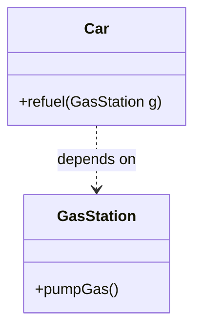
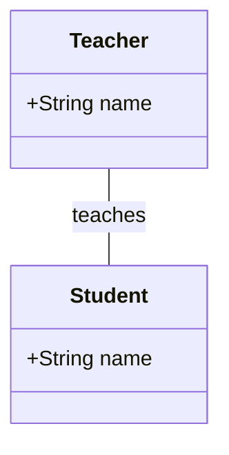
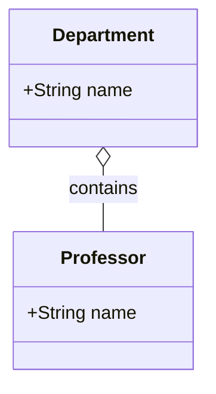
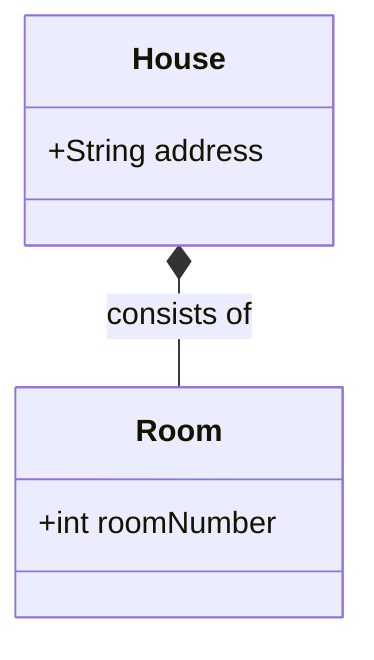
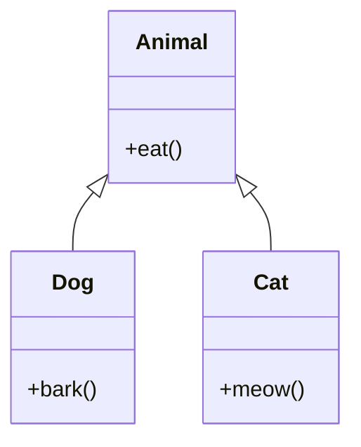
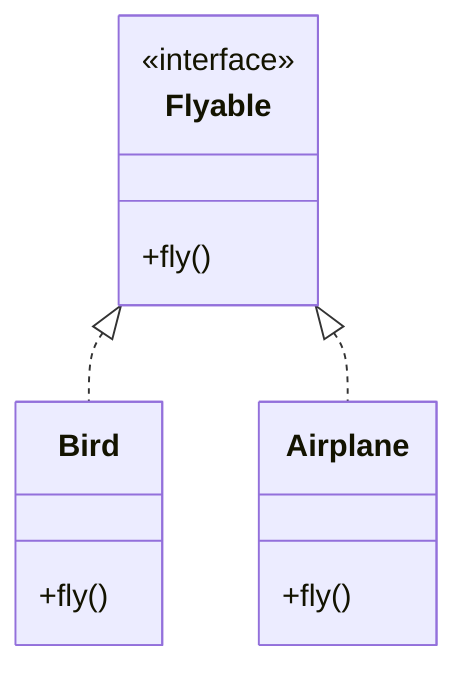
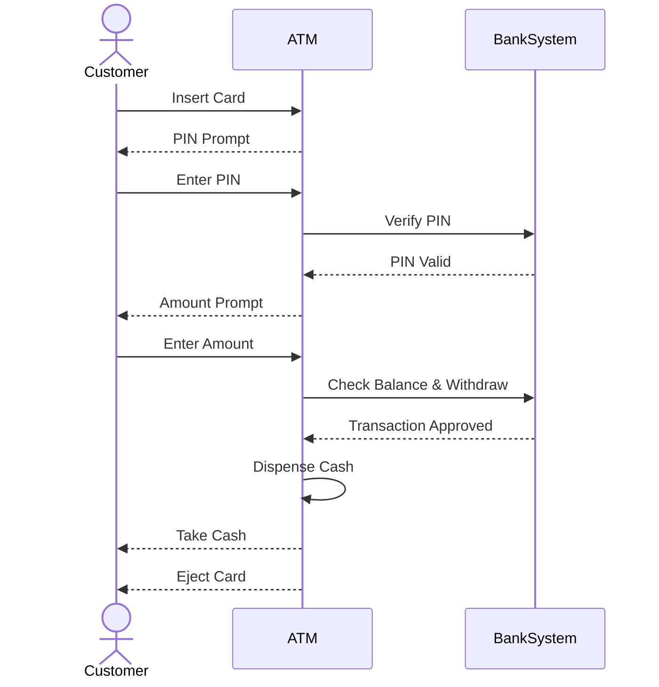

# UML (Unified Modeling Language) Diagrams - Study Guide

UML is a standard visual modeling language used to document, specify, construct, and visualize the artifacts of a software system. It provides a standard way to visualize a system's architectural blueprints, including elements such as:
- Any activities (jobs)
- Individual components of the system
- User interactions with the system
- How the system runs and how entities interact with others

---

## Types of UML Diagrams

UML diagrams are divided into two main categories: **Structural Diagrams** and **Behavioral Diagrams**.

### 1. Structural Diagrams
These diagrams show the static structure of the system and its parts on different abstraction and implementation levels.
- **Class Diagram**: Shows the structure of a system by describing its classes, their attributes, methods, and relationships among objects. (Most commonly used in LLD).
- **Component Diagram**: Shows the structural relationship of software components.
- **Deployment Diagram**: Shows the hardware of your system and the software in that hardware.
- **Object Diagram**: Shows a complete or partial view of the structure of a modeled system at a specific time.

### 2. Behavioral Diagrams
These diagrams show the dynamic behavior of the objects in a system, meaning how the system changes over time.
- **Use Case Diagram**: Represents a user's interaction with the system. Shows the relationship between the user and the different use cases in which the user is involved.
- **Activity Diagram**: Represents the step-by-step workflow of components in a system.
- **State Machine Diagram**: Shows the states of an object and the transitions between those states.

#### Interaction Diagrams (A subset of Behavioral Diagrams)
- **Sequence Diagram**: Shows object interactions arranged in time sequence.
- **Communication Diagram**: Shows the interactions between objects or parts in terms of sequenced messages.

---

## Deep Dive: Class Diagrams

Class diagrams are the backbone of Object-Oriented System Design. They map directly to object-oriented languages like Java, C++, etc.

### Components of a Class Diagram

A class is represented by a rectangle divided into three compartments:
1.  **Top**: Class Name
2.  **Middle**: Attributes (Properties/Variables)
3.  **Bottom**: Methods (Operations/Functions)

**Visibility Modifiers:**
- `+` Public
- `-` Private
- `#` Protected
- `~` Package/Default

### Relationships in Class Diagrams

Understanding relationships is critical for System Design. Here they are ordered from weakest to strongest coupling:

#### 1. Dependency
A weak relationship where a change in one class affects another. Usually, class A uses class B as a local variable or method parameter.
*Representation:* Dashed line with an open arrow.



#### 2. Association
A relationship where all objects have their own lifecycle and there is no owner.
*Representation:* Solid line.



#### 3. Aggregation (”Has-A” Relationship - Weak)
A specialized form of association where there is a whole-part relationship, but the parts can exist independently of the whole.
*Representation:* Solid line with an empty diamond at the *whole* end.


*(If the Department is closed, the Professors still exist and can join another department).*

#### 4. Composition (”Part-Of” Relationship - Strong)
A stricter form of aggregation where the lifespan of the part depends on the lifespan of the whole. If the whole is destroyed, the parts are destroyed.
*Representation:* Solid line with a filled diamond at the *whole* end.


*(If the House is destroyed, the Rooms are also destroyed).*

#### 5. Inheritance / Generalization (”Is-A” Relationship)
Indicates that a child class inherits from a parent class.
*Representation:* Solid line with an empty triangle pointing to the parent.



#### 6. Realization / Implementation
Used when a class implements an interface.
*Representation:* Dashed line with an empty triangle pointing to the interface.



---

## Deep Dive: Sequence Diagrams

Sequence diagrams are used to model the interaction between objects in a single use case. They illustrate how the different parts of a system interact with each other to carry out a function, ordered by time.

Key elements:
- **Lifelines**: Vertical dashed lines indicating the object's presence over time.
- **Actors**: Entities interacting with the system (users, external systems).
- **Messages**: Horizontal arrows showing communication between lifelines.
  - *Synchronous Message*: Solid arrow head (sender waits for response).
  - *Asynchronous Message*: Open arrow head (sender does not wait).
  - *Return Message*: Dashed line with open arrow head.
- **Activation Boxes**: Rectangles on lifelines indicating when an object is actively processing.

**Example Sequence Diagram for ATM Cash Withdrawal:**



---

## Use Case Diagrams

Use Case diagrams give a high-level view of what a system does and who interacts with it.
- **Actor**: Someone or something outside the system interacting with it (stick figure).
- **Use Case**: A specific functionality the system provides (oval).
- **System Boundary**: A box around the use cases indicating the system scope.

```mermaid
usecaseDiagram
    %% Mermaid currently has limited native support for strict use case diagrams in standard markdown, 
    %% but conceptually: Actor interacts with Ovals (Use Cases) inside a Rectangle (System).
```

## Summary for Interviews
1. **Class Diagrams** are your go-to for Low-Level Design (LLD). Practice drawing relationships (Composition vs Aggregation is a common interview question).
2. **Sequence Diagrams** are excellent for showing the flow of an API, microservice communications, or payment gateways.
3. Understand the symbols and arrowhead types perfectly:
   - Inheritance = Empty Triangle
   - Interface Implementation = Dashed line + Empty Triangle
   - Composition = Filled Diamond
   - Aggregation = Empty Diamond
   - Dependency = Dashed Arrow
